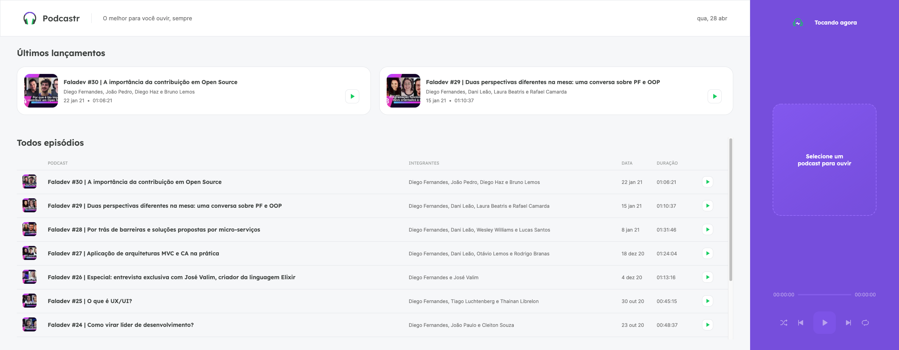
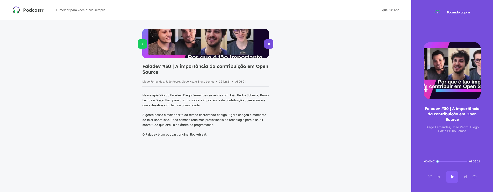

# Podcaster

## Projeto
O podcaster é um software de reprodução de podcasts desenvolvido na semana da next level week (NLW) promovido pela Rocketseat.

### Tela Inicial da aplicação


### Tela de detalhe do podcast


## Tecnologias
- React
- Nextjs
- Typescript
- Context Api
- Sass
- Axios
- Json server

## Comandos

Instalação:

```bash
npm install
# or
yarn
```

Ambiente de desenvolvimento:

```bash
npm run dev
# or
yarn dev
```

Ambiente de produção:

```bash
npm run start
# or
yarn start
```

Comando para geração build do projeto:

```bash
npm run build
# or
yarn build
```

